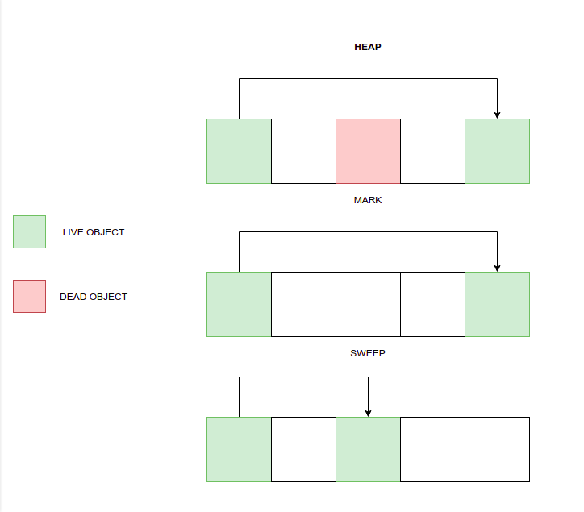

# Garbage Collector

A  garbage collector library, made as a project for my DSA - II course, implemented in C language. 

Name: Sameer Kavthekar
MIS: 111903153
Division 2


# Features

This garbage collector implements the mark and sweep algorithm along with the LISP2 algorithm for compaction.
This library allows you to:
 1. Dynamically allocate memory on the heap
 2. Free allocated memory
 3. Collect all garbage memory and free it automatically
 4. Compact memory after freeing it
 5. Compaction is enabled by default. To turn it off you can run the program by using -gC flag.


# Working

The main functions of my program are:
 1. ```gc_malloc()```
	  This is the function that dynamically allocates memory. This function 
	  adds a header, containing metadata to every allocated object. This
	  helps in tracking and collection of the object.
 2. ```gc_free()```
	  This function primarily deals with freeing garbage in the heap. This
	  function frees the object as well as the header.
 3. ```gc_mark()```
	  A function that recursively marks all the objects that are reachable 
	  from roots (i.e. pointers on the stack, pointers in the registers, global 
	  variables).
 4. ```gc_sweep()```
	 A function that frees every valid object that is not marked.
 5. ```gc_compact()```
	 A function that compacts the memory i.e. it moves all the live objects 
	 to the start of the heap.



# Usage

Make sure you have gcc installed
You can check by typing the following in your terminal
```
$ gcc --version
```
Clone the repository
```
$ git clone  https://github.com/sameerkavthekar/garbage-collector.git
```
Copy ```gc.c```, ```gc.h```, ```hashmap.c``` and ```hashset.c``` from the **src/** folder to your  project directory and include ```gc.h``` in your main file
```
#include "gc.h"
```
Compile program by using
```
gcc yourfiles.c gc.c hashmap.c hashset.c -o yourfile
```
# References

 - https://en.wikipedia.org/wiki/Tracing_garbage_collection
 - http://dmitrysoshnikov.com/compilers/writing-a-mark-sweep-garbage-collector/
 - https://www.youtube.com/watch?v=fGujNjkslvY
 - https://www.hboehm.info/gc/
 - https://en.wikipedia.org/wiki/Mark-compact_algorithm#LISP2_algorithm
 - http://www.cs.tau.ac.il/~maon/teaching/2014-2015/seminar/seminar1415a-lec2-mark-sweep-mark-compact.pdf